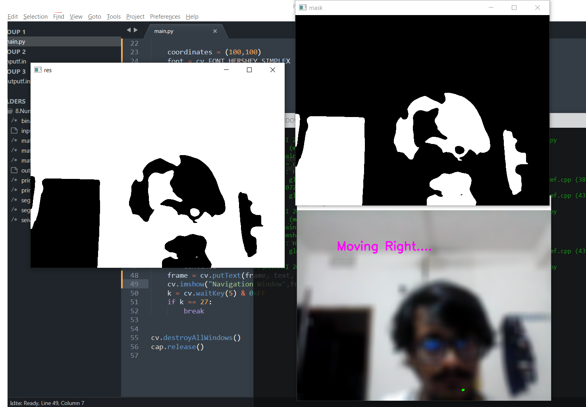

# Computer-Vision-Based-Rover-Navigation-Avoiding-Obstacle
Using Python and OpenCV to implement a basic obstacle avoidance and navigation on the rover.

### Install
```
pip install opencv-python
pip install numpy
 ```
### Todo
  1. Need to design more efficient algorithm to avoid obstacle and predict their positions.
  2. Need to test the system on Raspberry Pi 
  
### Preview

